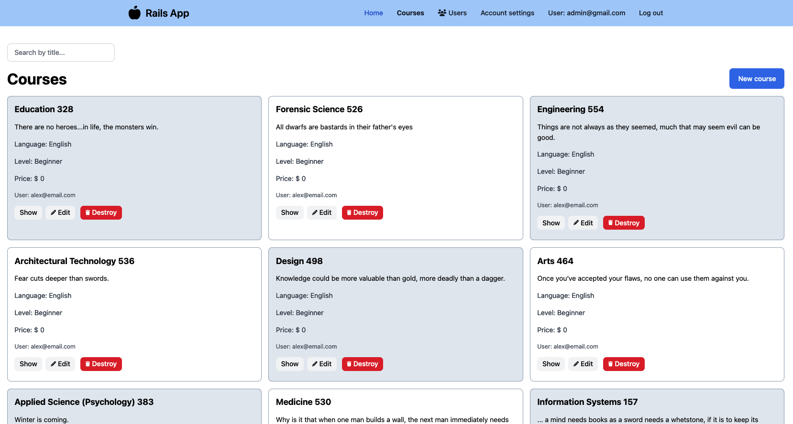

# README

Rails app, Udemy replica, login, create courses, manage users and more.
Under construction....

Things you may want to cover:

* Ruby version

3.2.2

# live demo link

https://rails-udemy-app-8bf8770dde9f.herokuapp.com

# Course View

